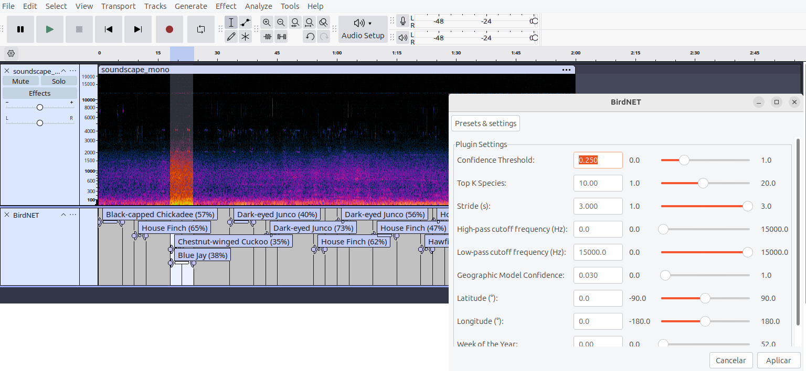

# 🎶 🐦‍⬛ Bioacoustic VAMP Plugins for Audacity and Sonic-Visualiser

[](https://opensource.org/licenses/MIT)
[](https://isocpp.org/)
[](https://www.python.org/downloads/)

[](https://www.audacityteam.org/)
[](https://www.sonicvisualiser.org/)

[](https://github.com/birdnet-team/birdnet)
[](https://www.kaggle.com/models/google/perch)
[](https://www.kaggle.com/models/google/surfperch)
[](https://www.tensorflow.org/hub/tutorials/yamnet)


A collection of Bioacoustic VAMP plugins for [Audacity](https://www.audacityteam.org/) and/or [Sonic-Visualiser](https://sonicvisualiser.org/) that run various bioacoustic models to automatically detect and label sounds in audio recordings.

This repository includes plugins for:
- **BirdNET v2.4**: Automatic bird species detection
- **Perch v2**: Bird species detection with improved accuracy
- **SurfPerch v1**: Reef soundscape classification (anthropophony, biophony, geophony)
- **YamNet v1**: General audio event classes from the AudioSet-YouTube corpus including biophony

Detections appear as labeled regions directly on the label track (Audacity) or as an annotation layer (Sonic-Visualiser), with the species/sound name and confidence score. Consecutive or overlapping detections of the same type are automatically merged into a single label.

### How it looks in Audacity


### How it looks in Sonic-Visualiser


## Features

- **BirdNET v2.4 Plugin**: Automatic bird species detection using BirdNET v2.4 (TensorFlow backend)
  - Nine configurable parameters:
    - **Confidence Threshold** — minimum confidence score to report a detection (default: 25%, interval [1:99])
    - **Top K Species** — maximum number of species candidates per segment (default: 10)
    - **Stride (s)** — sliding window step size in seconds (default: 3.0, interval [1.0,3.0])
    - **High-pass cutoff frequency** — minimum frequency for the bandpass filter in Hz (default: 0)
    - **Low-pass cutoff frequency** — maximum frequency for the bandpass filter in Hz (default: 15000)
    - **Latitude** — latitude for geographic species filtering; 0.0 = disabled (default: 0.0)
    - **Longitude** — longitude for geographic species filtering; 0.0 = disabled (default: 0.0)
    - **Week of the Year** — week number (1–52) for seasonal filtering; 0 = disabled (default: 0)
    - **Geographic Model Confidence** — minimum confidence for the geographic model filter (default: 3.0%, interval [1:99])
- **Perch v2 and SurfPerch v1 Plugins**: Bird species detection with improved accuracy
  - Three configurable parameters:
    - **Confidence Threshold** — minimum confidence score to report a detection (default: 25%, interval [1,99])
    - **Top K Species** — maximum number of species candidates per segment (default: 10)
    - **Stride (s)** — sliding window step size in seconds (default: 3.0, interval [1.0,3.0])
- Works on full recordings or selected segments
- Consecutive and overlapping detections of the same type are merged automatically
- Optional geographic and seasonal filtering using BirdNET's built-in geo model (BirdNET plugin only)

## Requirements

- Ubuntu >= 22.04 with an internet connection 
- [uv](https://github.com/astral-sh/uv) (an extremely fast Python package and project manager, written in Rust)

## Installation

### 1. Download the latest release

Download the file `bioacoustic-vamp-pack-ubuntu-latest.zip` from the [latest release](https://github.com/juancolonna/bioacoustic-vamp-pack/releases/latest) on GitHub.

### 2. Extract and install

```bash
unzip bioacoustic-vamp-pack-ubuntu-latest.zip
mkdir -p ~/vamp
cp bioacoustic-vamp-pack-ubuntu-latest/* ~/vamp/
```

This will copy all necessary plugin files (`.so` libraries, Python scripts, and label files) into your `~/vamp` directory.

## Running

Set the VAMP_PATH environment variable and launch your installed Audacity or Sonic-Visualiser:

```bash
rm -f ~/.config/audacity/pluginregistry.cfg
export VAMP_PATH=$HOME/vamp
audacity
```
or
```bash
export VAMP_PATH=$HOME/vamp
sonic-visualiser
```

If you prefer to use an AppImage, download the official Audacity or Sonic-Visualiser AppImage from the project website and run it with `VAMP_PATH=$HOME/vamp`, for example:

```bash
sudo chmod +x ~/Downloads/Audacity-3.7.7-x86_64.AppImage
VAMP_PATH="$HOME/vamp" "$HOME/Downloads/Audacity-3.7.7-x86_64.AppImage"
```

or:

```bash
sudo chmod +x ~/Downloads/SonicVisualiser-5.2.1-x86_64.AppImage
VAMP_PATH="$HOME/vamp" "$HOME/Downloads/SonicVisualiser-5.2.1-x86_64.AppImage"
```

The plugins will appear in the Analyze menu (Audacity) or Transform menu (Sonic-Visualiser).

## Usage on Audacity

1. Open an audio file in Audacity (**File → Open**)
2. Optionally select a specific region of the track to analyze
3. Go to **Analyze → Bioacoustics** and chose the desired plugin
4. Adjust parameters if desired
5. Click **OK** and wait for the analysis to complete
6. Detections appear as labeled regions on a new label track

## Usage on Sonic-Visualiser

1. Open an audio file in Sonic-Visualiser (**File → Open**)
2. Optionally select a specific region of the track to analyze
3. Go to **Transform → Analysis by Maker → Bioacoustics** and chose the desired plugin
4. Adjust parameters if desired
5. Click **OK** and wait for the analysis to complete
6. Detections appear as labeled regions on a new label layer

> **Note:** Stereo audio files are automatically mixed down to mono by averaging both channels when you execute any of the plugins, which may produce slightly different results compared to a native mono recording. If you are unsure, convert your audio to mono before running the analysis.

## Annotation format

Each label on the track follows the format:

```
Scientific Name (XX%)
```

For example:
```
Poecile atricapillus (56%)
Haemorhous mexicanus (65%)
...
```

Where `XX%` is the average confidence score across all merged segments.

> **Tip:** The output labels can be exported in CSV format via **File → Export Other → Export Labels** in Audacity, or via **File → Export Annotation Layer** in Sonic Visualiser, for further analysis.

## How it works

1. When a plugin (BirdNET, Perch, or SurfPerch) is triggered, the VAMP plugin accumulates all audio samples into a buffer
2. At the end of the stream, it writes the buffer to a temporary WAV file
3. It invokes the corresponding Python script (`birdnet_run.py`, `perch_run.py`, or `surfperch_run.py`) as a subprocess using the Python interpreter from the `uv` virtual environment
4. The Python script runs the respective model inference and returns detections as a JSON array via stdout
5. Consecutive or overlapping detections of the same type are merged into single labels
6. The plugin reads the JSON, creates VAMP features, and displays them as labeled regions in Audacity or Sonic-Visualiser
7. The temporary WAV file is deleted after processing

## Geographic and Seasonal Filtering on BirdNET

When Latitude 'and' Longitude are set to non-zero values, the plugin activates BirdNET's geographic model to filter the species list before running acoustic inference. This restricts detections to species that are realistically expected at the given location, significantly reducing false positives. Optionally, setting Week of the Year (1–52) further narrows the filter to species expected at that location during that season. For example, a migratory species present only in summer will be excluded outside its expected seasonal window.

The Geographic Model Confidence parameter controls how broadly the geo model selects candidate species. Lower values (e.g., 1%) include more species in the filter; higher values (e.g., 3%) apply a stricter regional filter.

> **Note:** Geographic filtering has no effect if latitude is set to 90.0 or -90.0.

## Troubleshooting

**Plugin does not appear in Analyze menu**
- Make sure `VAMP_PATH` is set to `$HOME/vamp` (or `~/vamp`)
- Ensure the plugin files (`.so`, `.py` and `.csv` files) are in the `~/vamp` directory
- Restart Audacity or Sonic-Visualiser after setting VAMP_PATH

**No detections produced**
- Try lowering the **Confidence Threshold** (e.g., 10%)
- Make sure the audio contains the expected sounds (bird vocalizations for BirdNET/Perch, reef sounds for SurfPerch)
- Check that the `uv` is correctly installed: `curl -LsSf https://astral.sh/uv/install.sh | sh`

**Audacity shows "not responding" during analysis**
- This is expected — model inference with TensorFlow can take 10–30 seconds depending on audio length
- Click **Wait** and the analysis will complete normally

## Citation

If you use this plugin in your research, please cite:

```bibtex
@software{colonna2026bioacoustic_vamp,
  author  = {Colonna, Juan G.},
  title   = {Bioacoustic VAMP Plugins for Audacity and Sonic-Visualiser},
  year    = {2026},
  url     = {https://github.com/juancolonna/birdnet-vamp-plugin}
}
```

## License and Author

MIT License — see [LICENSE](LICENSE) for details.

**Prof. Dr. Juan G. Colonna, IComp,UFAM** — [github.com/juancolonna](https://github.com/juancolonna)
